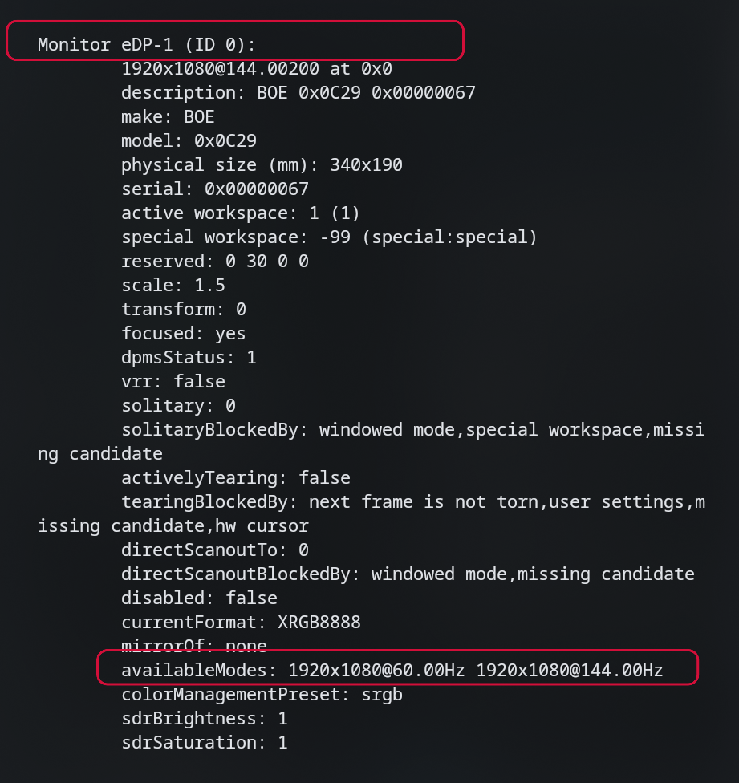
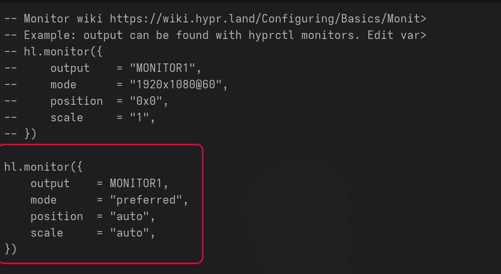
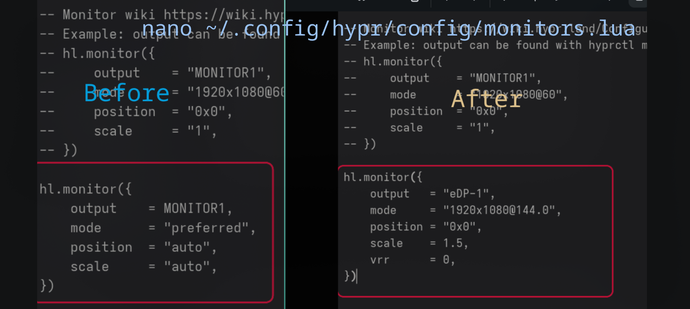

# CachyOS + Hyprland — Monitor Refresh Rate Quick Fix

A quick guide for fixing monitor refresh-rate issues on **CachyOS + Hyprland**, especially when your display is stuck at `60 Hz` even though a higher refresh rate such as `120 Hz`, `144 Hz`, or `165 Hz` is available.

---

## 1. Check Your Monitor

First, check your monitor name, resolution, and available refresh rates:

```bash
hyprctl monitors all
```

Look for something similar to:

```text
Monitor eDP-1
1920x1080@60.00100
availableModes: 1920x1080@60.00Hz 1920x1080@144.00Hz
```



In this example:

* **Monitor:** `eDP-1`
* **Resolution:** `1920x1080`
* **Current refresh rate:** `60 Hz`
* **Available refresh rate:** `144 Hz`

> ⚠️ **Your values may be different.**
>
> Always use the monitor name, resolution, and refresh rate shown on **your own system**.

---

## 2. Open the Monitor Configuration

If your Hyprland setup uses the Lua-based configuration, open:

```bash
nano ~/.config/hypr/config/monitors.lua
```

Find the existing `hl.monitor({ ... })` section.

For example:

```lua
hl.monitor({
    output = MONITOR1,
    mode = "preferred",
    position = "auto",
    scale = "auto",
})
```



This configuration may currently use `preferred`, which can result in Hyprland selecting a lower refresh rate.

---

## 3. Set Your Desired Refresh Rate

Replace the existing monitor configuration with the correct values for your display.

### Example 1 — 1920×1080 @ 144 Hz

```lua
hl.monitor({
    output   = "eDP-1",
    mode     = "1920x1080@144.0",
    position = "0x0",
    scale    = 1.5,
    vrr      = 0,
})
```

### Example 2 — 2560×1440 @ 165 Hz

```lua
hl.monitor({
    output   = "DP-1",
    mode     = "2560x1440@165.0",
    position = "0x0",
    scale    = 1.0,
    vrr      = 0,
})
```

### Example 3 — 1920×1200 @ 120 Hz

```lua
hl.monitor({
    output   = "eDP-1",
    mode     = "1920x1200@120.0",
    position = "0x0",
    scale    = 1.0,
    vrr      = 0,
})
```



> ⚠️ **These are examples only.**
>
> Replace the values with the ones supported by your own monitor.

| Setting     | Description      |
| ----------- | ---------------- |
| `eDP-1`     | Monitor name     |
| `1920x1080` | Resolution       |
| `144.0`     | Refresh rate     |
| `1.5`       | Display scale    |
| `0x0`       | Monitor position |

You can find your actual values with:

```bash
hyprctl monitors all
```

---

## 4. Check for Conflicting Monitor Settings

If Hyprland keeps switching back to `60 Hz`, another configuration may be overriding your settings.

Search your Hyprland configuration:

```bash
grep -RniE 'monitor|preferred|60\.0' ~/.config/hypr/
```

Look for old configurations such as:

```ini
monitor=eDP-1,1920x1080@60.0,0x0,1.5
```

If you find one, remove it or change it to your desired refresh rate.

Also check:

```text
~/.config/hypr/monitors.conf
```

Make sure another configuration is not forcing the monitor back to `60 Hz`.

---

## 5. Reload Hyprland

Reload your Hyprland configuration:

```bash
hyprctl reload
```

Then check your monitor again:

```bash
hyprctl monitors all
```

You should now see your desired refresh rate:

```text
1920x1080@144.00Hz
```

If the correct refresh rate is displayed:

**Done. ✅**

---

# Fastest Way — Only works on hyperland

If you are using **Hyprmod**, you can use its monitor configuration instead of manually editing `monitors.lua`.

Dowload hyprmod
```bash
sudo pacman -S paru
paru -S hyprmod
```

Open hyprmod app Go to:

```text
Hyprmod
└── Monitors
    └── Select your monitor
        └── Change Refresh Rate / Hz
```

Choose the refresh rate supported by your monitor.

For example:

```text
eDP-1
1920x1080
144 Hz
```

or:

```text
DP-1
2560x1440
165 Hz
```

After applying the change, verify it:

```bash
hyprctl monitors all
```

If your desired refresh rate is shown, you're done. ✅

> ⚠️ **Important:** The exact Hyprmod menu or configuration path may vary depending on your Hyprmod version.

---

# Quick Troubleshooting

### My monitor is still at 60 Hz

Run:

```bash
hyprctl monitors all
```

Check whether your desired refresh rate appears under:

```text
availableModes
```

For example:

```text
availableModes: 1920x1080@60.00Hz 1920x1080@144.00Hz
```

If `144 Hz` is available but Hyprland is still using `60 Hz`, check for conflicting monitor configurations.

### Invalid mode error

Make sure the resolution and refresh rate match one of the modes reported by:

```bash
hyprctl monitors all
```

For example:

```text
2560x1440@165.00Hz
```

Use:

```lua
mode = "2560x1440@165.0"
```

---

# Quick Summary

```text
1. hyprctl monitors all
          ↓
2. Find monitor + resolution + available Hz
          ↓
3. Edit monitors.lua
          ↓
4. Set the desired refresh rate
          ↓
5. Check for conflicting configurations
          ↓
6. hyprctl reload
          ↓
7. hyprctl monitors all
          ↓
8. Desired Hz → DONE ✅
```

---

## ⚠️ Important

The following values are **examples**:

```text
eDP-1
1920x1080
144 Hz
1.5 scale
```

Your system may use completely different values.

Always check your own monitor first:

```bash
hyprctl monitors all
```

### Example configurations

```text
eDP-1     → 1920x1080 @ 144 Hz
DP-1      → 2560x1440 @ 165 Hz
HDMI-A-1  → 1920x1080 @ 120 Hz
```

Do not use a refresh rate that your monitor does not support.
